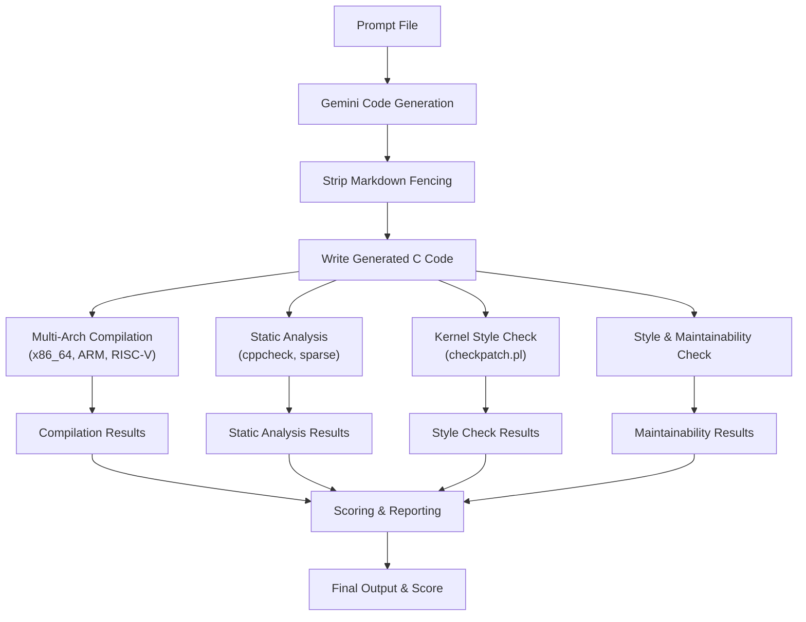

# Project Tools, Commands, and Workflow Explanation

## 1. Python Packages and Tools

### `requests`
- **Purpose:** Makes HTTP requests from Python (used to call Gemini API for code generation).

---

## 2. External Tools and Packages

### `gcc`
- **Purpose:** Native C compiler for x86_64. Compiles generated driver code for your machine.

### `arm-none-eabi-gcc` / `gcc-arm-linux-gnueabi`
- **Purpose:** Cross-compiler for ARM. Compiles code as if for an ARM device.

### `riscv64-elf-gcc` / `gcc-riscv64-linux-gnu`
- **Purpose:** Cross-compiler for RISC-V. Compiles code as if for a RISC-V device.

### `cppcheck`
- **Purpose:** Static analysis for C/C++ code. Finds bugs and style issues.

### `sparse`
- **Purpose:** Static analysis for Linux kernel code. Finds type, locking, and API usage issues.

### `checkpatch.pl`
- **Purpose:** Checks code for Linux kernel coding style compliance.

---

## 3. Key Commands and What They Do

### Install Python Package
```bash
pip install requests
```
- Installs the `requests` library for HTTP requests in Python.

### Install Compilers and Tools (Arch Linux)
```bash
sudo pacman -S gcc cppcheck sparse arm-none-eabi-gcc riscv64-elf-gcc
```
- Installs all required compilers and analysis tools.

### Install Compilers and Tools (Ubuntu/Debian)
```bash
sudo apt update
sudo apt install gcc cppcheck sparse gcc-arm-linux-gnueabi gcc-riscv64-linux-gnu
```
- Installs all required compilers and analysis tools.

### Run the Evaluation Pipeline
```bash
python3 main.py
```
- Runs the full evaluation pipeline: code generation, compilation, analysis, scoring.

### Example Compilation Commands
```bash
gcc -Wall -Wextra -Werror -c test_samples/generated_driver.c
arm-none-eabi-gcc -Wall -Wextra -Werror -c test_samples/generated_driver.c
riscv64-elf-gcc -Wall -Wextra -Werror -c test_samples/generated_driver.c
```
- Compiles the code for x86_64, ARM, and RISC-V architectures.

### Static Analysis
```bash
cppcheck test_samples/generated_driver.c
sparse test_samples/generated_driver.c
```
- Runs static analysis on the generated code.

### Kernel Style Check
```bash
perl checkpatch.pl --no-tree --file test_samples/generated_driver.c
```
- Checks for Linux kernel coding style violations.

---

## 4. Summary Table

| Tool/Command                | What it Does                                              |
|-----------------------------|----------------------------------------------------------|
| `requests` (Python)         | Calls Gemini API for code generation                     |
| `gcc`                       | Compiles C code for x86_64                               |
| `arm-none-eabi-gcc`         | Compiles C code for ARM                                  |
| `riscv64-elf-gcc`           | Compiles C code for RISC-V                               |
| `cppcheck`                  | Static analysis for C/C++                                |
| `sparse`                    | Kernel static analysis                                   |
| `checkpatch.pl`             | Kernel coding style check                                |
| `python3 main.py`           | Runs the full evaluation pipeline                        |

---

## 5. Workflow Diagram



---

If you need more details or want to expand this documentation, let me know! 